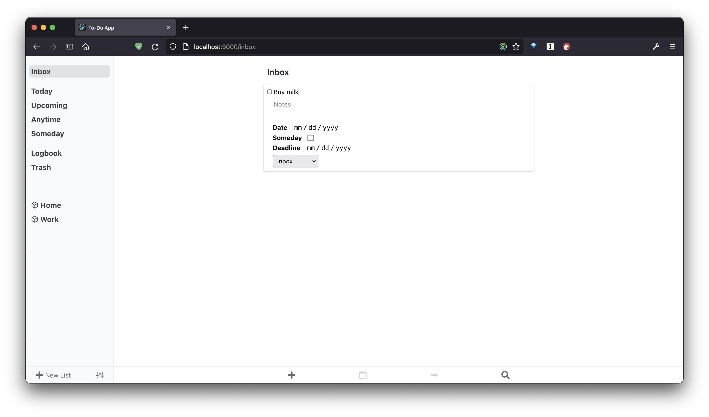

# Things React Clone
I'm currently learning React and as a way of practice I'm trying to build the closest thing I can to
the [Things](http://culturedcode.com/things/) macOS app. I'm focusing first on functionality and then on the styling (I'm leaving the Todo Card to the end).

This is how it currently looks.

Check it out here: https://sebastianknell.github.io/todo-app/

## Next To-Do's
* Project/Areas CRUD
* Footer actions
  * Custom calendar component
  * Location selector component
